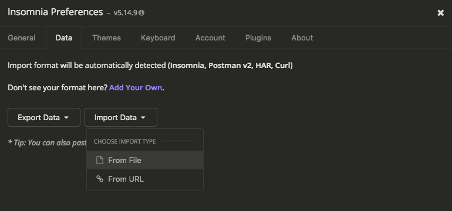

# Debug the api with a rest client

First, download Insomnia [here](https://insomnia.rest/download/).

Go to your insomnia preferences.

In Preferences, select the Data tab and import the file `api-requests.json`.

Enjoy! :p

